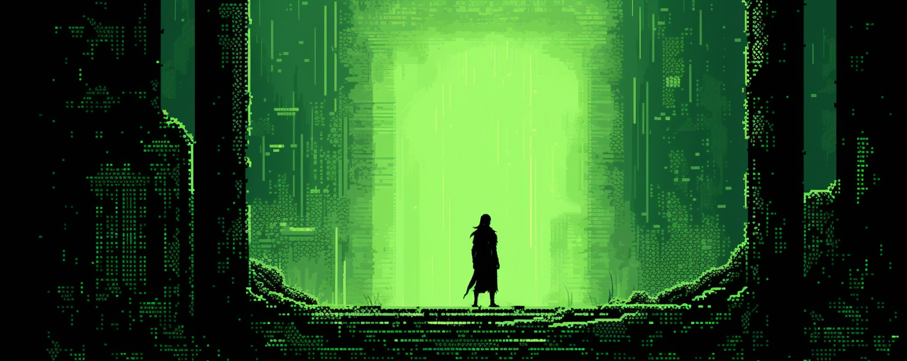

<a href="https://twitter.com/lootrealms">

</a>
<a href="https://twitter.com/BibliothecaDAO">

</a>


[](https://discord.gg/realmsworld)
[](https://opensource.org/licenses/MIT)




## 🪦 Loot Survivor

> Go and die with glory

Play [Loot Survivor](https://goerli-survivor.realms.world/)

Table of contents

- [Game Design](#🕹️-game-design)
- [Technology](#⛓️-technology)
- [Infrastructure](#🖥️-infrastructure)
- [Contributing](#🏗️-contributing)

---

## 🕹️ Game Design

Loot Survivor is an onchain Arcade machine game. You add some tokens, try to get the highscore and live for eternity onchain.

Each play through will be different and there is no end to the game. Every level just gets progressively harder.

<details>

<summary>Game Statistics</summary>
Each level up grants adventurers 1+ upgrade to help them survive their explorations. Although Luck cannot be upgraded directly, it can be increased by equipping jewelry items:

- Strength: Boosts attack damage by 10%.
- Vitality: Increases health by +20ph and max health.
- Dexterity: Improves chances of successfully fleeing.
- Wisdom: Helps evade Beast ambushes.
- Intelligence: Aids in avoiding Obstacles.
- Luck: Raises chances of critical damage (cannot be upgraded directly).
</details>

<details>

<summary>Combat Logic</summary>

There are three categories of weapons and armor materials:

**Weapons**: Blade, Bludgeon, Magic

**Armor materials**: Cloth, Hide, Metal 

**Weapon vs. Armor Efficacy Chart**

| Weapon Type | Metal | Hide | Cloth |
|-------------|-------|------|-------|
| Blade       | Weak  | Fair | Strong|
| Bludgeon    | Fair  | Strong| Weak|
| Magic       | Strong | Weak | Fair |


</details>

<details>
<summary>Weapons and Materials</summary>

## Weapons

The items are based off the OG loot contract

- Weapon
- Head
- Chest
- Hands
- Waist
- Feet
- Neck 
- Ring

**Weapon Types and Ranks**

| Weapon Type | Item Name     | Rank |
|-------------|---------------|------|
| Blade       | Katana        | 1    |
| Blade       | Falchion      | 2    |
| Blade       | Scimitar      | 3    |
| Blade       | Long Sword    | 4    |
| Blade       | Short Sword   | 5    |
| Bludgeon    | Warhammer     | 1    |
| Bludgeon    | Quarterstaff  | 2    |
| Bludgeon    | Maul          | 3    |
| Bludgeon    | Mace          | 4    |
| Bludgeon    | Club          | 5    |
| Magic       | Ghost Wand    | 1    |
| Magic       | Grave Wand    | 2    |
| Magic       | Bone Wand     | 3    |
| Magic       | Wand          | 4    |
| Magic       | Grimoire      | 1    |
| Magic       | Chronicle     | 2    |
| Magic       | Tome          | 3    |
| Magic       | Book          | 4    |

## Encounters

- Beasts 
- Obstacles 

</details>

---

## 🏗️ Contributing

The game is a work in progress and contributions are greatly appreciated.

---

## ⛓️ Technology


Loot Survivor is an onchain game, designed to be immutable and permanently hosted on Starknet. We use advanced gas optimization to reduce costs on Starknet. A player's gamestate exists primarily in a single felt252, every action the player takes only updates a single storage slot.


- Client: Nextjs
- Indexer: Apibara
- Graphql: Strawberry, AIOHTTP
- Contracts: Cairo 1.0

---

## 🖥️ Infrastructure

### Servers

#### Goerli

- Indexer: Northflank loot-survivor-indexer
- Mongo DB: Northflank loot-survivor-mongo-goerli
- Graph QL: Northflank loot-survivor-graphql

---

### Deploying

#### Setup Starkli Account

```bash
bash scripts/starkli_setup.sh
```

#### Deploy Contract
```bash
bash scripts/deploy.sh.sh
```

#### Run UI

```bash
cd ui
yarn dev
```

#### Deploy Katana & Run UI

```bash
bash scripts/katana/setup.sh
```

### Play

#### Mint $lords and approve LS to spend
```bash
source "/workspaces/loot-survivor/.env"
starkli invoke $LORDS_ADDRESS mint 0x1feb9c05d31b70a1506decf52a809d57493bfcd5cc85d6a3e9fd54a12d64389 1000000000000000000000 0 --account $STARKNET_ACCOUNT --private-key $PRIVATE_KEY
starkli invoke $LORDS_ADDRESS approve $CONTRACT_ADDRESS 1000000000000000000000 0 --account $STARKNET_ACCOUNT --private-key $PRIVATE_KEY
```

#### Start New Game
```bash
starkli invoke $CONTRACT_ADDRESS new_game 0x020b96923a9e60f63a1829d440a03cf680768cadbc8fe737f71380258817d85b 12 123 0 0 0 --account $STARKNET_ACCOUNT --private-key $PRIVATE_KEY
```

#### Explore
```bash
starkli invoke $CONTRACT_ADDRESS explore $ADVENTURER_ID 0 --account $STARKNET_ACCOUNT --private-key $PRIVATE_KEY
```

#### Attack Starter Beast
```bash
starkli invoke $CONTRACT_ADDRESS attack $ADVENTURER_ID 0 --account $STARKNET_ACCOUNT --private-key $PRIVATE_KEY
```

#### Upgrade Adventurer
```bash
starkli invoke $CONTRACT_ADDRESS upgrade $ADVENTURER_ID 0 $CHARISMA 1 --account $STARKNET_ACCOUNT --private-key $PRIVATE_KEY
```


### View Adventurer Details

##### Adventurer State
```bash
starkli call --watch $CONTRACT_ADDRESS get_adventurer $ADVENTURER_ID 0 --account $STARKNET_ACCOUNT --private-key $PRIVATE_KEY
```

##### Get Adventurer Health
```bash
starkli call --watch $CONTRACT_ADDRESS get_health $ADVENTURER_ID 0 --account $STARKNET_ACCOUNT --private-key $PRIVATE_KEY
```

##### Get Adventurer Gold
```bash
starkli call --watch $CONTRACT_ADDRESS get_gold $ADVENTURER_ID 0 --account $STARKNET_ACCOUNT --private-key $PRIVATE_KEY
```

##### Get Adventurer XP
```bash
starkli call --watch $CONTRACT_ADDRESS get_xp $ADVENTURER_ID 0 --account $STARKNET_ACCOUNT --private-key $PRIVATE_KEY
```

##### Get number of stat upgrades available
```bash
starkli call --watch $CONTRACT_ADDRESS get_stat_upgrades_available $ADVENTURER_ID 0 --account $STARKNET_ACCOUNT --private-key $PRIVATE_KEY
```